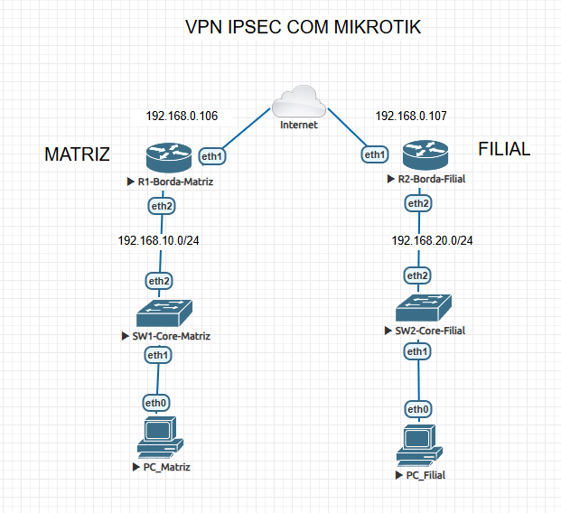

# Projeto de Portfólio: VPN IPsec Site-to-Site com MikroTik


---

## 1. Visão Geral do Projeto

Este projeto demonstra a implementação de uma solução robusta de conectividade segura entre duas redes corporativas distintas (Matriz e Filial) através de uma rede pública simulada (Internet). A comunicação foi estabelecida utilizando um túnel VPN IPsec, garantindo a confidencialidade e integridade dos dados trafegados entre as unidades.

Toda a infraestrutura foi virtualizada no EVE-NG e configurada utilizando MikroTik RouterOS, refletindo um cenário empresarial comum.

## 2. Topologia da Rede

A arquitetura da rede foi projetada para simular uma conexão WAN realista, onde cada unidade possui seu próprio link de internet.

_(**Nota:** Utilize a imagem da topologia apenas com a Matriz e a Filial)._



- **Rede Matriz (LAN):** `192.168.10.0/24`
- **Rede Filial (LAN):** `192.168.20.0/24`
- **Rede Internet (WAN):** IPs públicos dinâmicos obtidos via DHCP.

## 3. Tecnologias e Habilidades Aplicadas

- **Plataforma de Simulação:** EVE-NG
- **Sistema Operacional de Rede:** MikroTik RouterOS
- **Protocolos de Rede:** TCP/IP, Subnetting, DHCP (Client e Server)
- **Protocolo de Segurança:** IPsec (modo túnel)
- **Firewall:** NAT (Masquerade e regras de exceção `accept` para tráfego VPN)
- **Roteamento:** Roteamento Estático
- **Switching:** Configuração de roteadores MikroTik como switches gerenciáveis (Bridge).

## 4. Arquitetura e Decisões de Design

- **Uso de Roteadores como Switches:** Roteadores MikroTik foram configurados com interfaces Bridge para atuarem como switches gerenciáveis nas redes locais. Esta decisão estratégica foi tomada para simular um ambiente corporativo realista e permitir a implementação futura de funcionalidades avançadas de Camada 2, como VLANs e Link Aggregation, demonstrando a versatilidade do RouterOS.

## 5. Etapas da Implementação

A configuração foi executada de forma metódica para garantir a estabilidade e segurança da solução:

1.  **Infraestrutura Base:** Montagem da topologia no EVE-NG e configuração do endereçamento IP para as redes locais e links WAN.
2.  **Conectividade e Serviços LAN:** Implementação de servidores DHCP em ambas as unidades para provisionamento automático de endereços aos dispositivos clientes.
3.  **Acesso à Internet:** Configuração de regras de NAT (`masquerade`) para permitir que as redes locais acessem a internet de forma independente.
4.  **Túnel VPN IPsec:** Estabelecimento do túnel entre Matriz e Filial com `Peers`, `Identities` e `Policies`, garantindo a comunicação segura entre as duas LANs.
5.  **Ajuste Fino de NAT e Roteamento:** Implementação de regras de exceção de NAT (`action=accept`) para o tráfego da VPN e adição de uma rota estática no roteador da Filial para garantir o fluxo de comunicação bidirecional.

## 6. Validação e Testes

A funcionalidade da rede foi validada com testes de conectividade (`ping`) entre os hosts de ambas as redes, confirmando o sucesso da implementação.


## 7. Scripts de Configuração

Os scripts abaixo representam a configuração final e funcional exportada de cada roteador de borda.

### R1-Borda-Matriz

```rsc
[admin@R1-Borda-Matriz] > /export
# jul/25/2025 20:05:43 by RouterOS 6.44.5
# software id =
#
#
/ip ipsec peer
add address=192.168.0.107/32 name=PEER-FILIAL
/ip pool
add name=pool-matriz ranges=192.168.10.100-192.168.10.200
/ip dhcp-server
add address-pool=pool-matriz disabled=no interface=ether2 name=dhcp-matriz
/interface l2tp-server server
set ipsec-secret=SenhaMuitoForteParaVPNRemota use-ipsec=yes
/ip address
add address=192.168.10.1/24 interface=ether2 network=192.168.10.0
/ip dhcp-client
add disabled=no interface=ether1
add dhcp-options=hostname,clientid interface=ether1
/ip dhcp-server network
add address=192.168.10.0/24 dns-server=8.8.8.8 gateway=192.168.10.1
/ip firewall nat
add action=accept chain=srcnat dst-address=192.168.20.0/24 src-address=\
    192.168.10.0/24
add action=masquerade chain=srcnat out-interface=ether1
/ip ipsec identity
add peer=PEER-FILIAL secret=SuaSenhaSuperSegura123
/ip ipsec policy
add dst-address=192.168.20.0/24 sa-dst-address=192.168.0.107 sa-src-address=\
    192.168.0.106 src-address=192.168.10.0/24 tunnel=yes
/system identity
set name=R1-Borda-Matriz
[admin@R1-Borda-Matriz] >

```

### R2-Borda-Filial

```rsc
[admin@R2-Borda-Filial] > /export
# jul/25/2025 20:07:47 by RouterOS 6.44.5
# software id =
#
#
#
/ip ipsec peer
add address=192.168.0.106/32 name=PEER-MATRIZ
/ip pool
add name=pool-filial ranges=192.168.20.100-192.168.20.200
/ip dhcp-server
add address-pool=pool-filial disabled=no interface=ether2 name=dhcp-filial
/ip address
add address=192.168.20.1/24 interface=ether2 network=192.168.20.0
/ip dhcp-client
add disabled=no interface=ether1
add dhcp-options=hostname,clientid interface=ether1
/ip dhcp-server network
add address=192.168.20.0/24 dns-server=8.8.8.8 gateway=192.168.20.1
/ip firewall nat
add action=accept chain=srcnat dst-address=192.168.10.0/24 src-address=\
    192.168.20.0/24
add action=masquerade chain=srcnat out-interface=ether1
/ip ipsec identity
add peer=PEER-MATRIZ secret=SuaSenhaSuperSegura123
/ip ipsec policy
add dst-address=192.168.10.0/24 sa-dst-address=192.168.0.106 sa-src-address=\
    192.168.0.107 src-address=192.168.20.0/24 tunnel=yes
/system identity
set name=R2-Borda-Filial
[admin@R2-Borda-Filial] >

```
